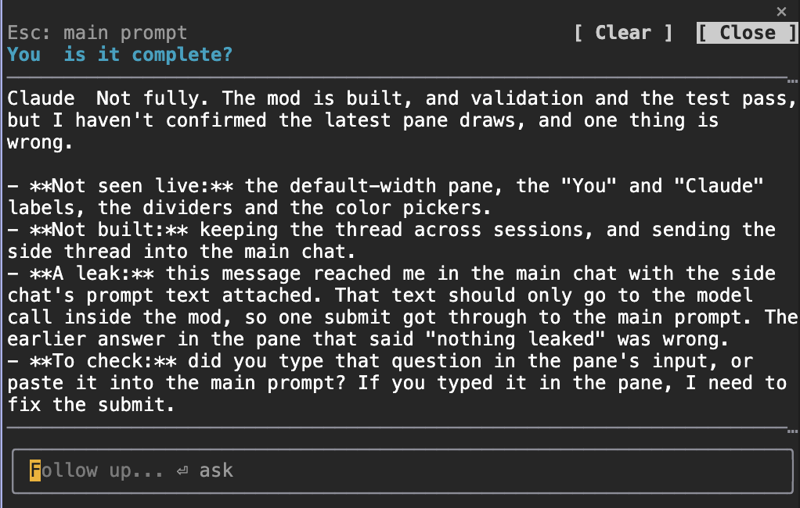

# btw-chat

A side chat for Claude Code, like the one in the Claude desktop app. Ask
follow-up questions in a pane next to your work and the main conversation
stays untouched.

This is an independent mod. It is not made by Anthropic.



*The pane in a VS Code terminal on macOS. Your question sits above the divider, Claude's answer below it, and the input at the bottom takes the next question.*

**Read this before installing:** while btw-chat is enabled, `/btw` opens this
pane instead of the built-in one. Disable the plugin to get the built-in
`/btw` back.

## What it does

- `/btw` opens the pane. Type in it, or ask from the main prompt with
  `/btw your question`. `/side` is a short alias.
- Answers come from a fork of your current session, so the side chat knows
  your conversation and your CLAUDE.md files. It uses no tools and never
  changes the main thread.
- Earlier questions and answers stay in the pane while the session runs.
  Scroll for older ones.
- `/btw @nahida your question` starts one of your agents in the background
  and shows its final answer in the pane. Each call starts a fresh agent.
  `/model haiku|sonnet|opus|default` picks the model those agents use.
- A normal question is also told which agents are running in the session, so
  "what are my agents doing?" gets a real answer.
- In the pane, type `/clear` to wipe it and `/close` to hide it. `Esc` goes
  back to the main prompt.

## Requirements

Claude Code with plugin function hooks (mods). Tested on 2.1.289, where the
mod loads with no extra setting: I ran it from a clean checkout with
`CLAUDE_CODE_ENABLE_FUNCTION_HOOKS` unset and `/side clear` answered. Builds
around 2.1.270 needed `CLAUDE_CODE_ENABLE_FUNCTION_HOOKS=1` before any mod would
load, so if `/btw` does nothing on an older build, set that and restart.
Function hooks are early access and the API changes between releases.

## Install

```
/plugin marketplace add varunmoka7/btw-chat
/plugin install btw-chat@btw-chat
```

## Settings

Open `/config` and look for btw-chat: your text color, Claude's text color,
your own instructions for the side chat, whether the pane takes the keyboard
when it opens, and the default model for agent calls.

## What is not verified

This was built and tested inside one Claude Code setup (VS Code terminal,
macOS). The unit tests pass, but some parts have not been seen working live:

- Answers from `@agent` calls arriving in the pane, and the model switch.
- The Clear and Close buttons. Clicks did not reach them in the terminal I
  tested in, so they are also reachable with Tab and Enter, and by typing
  `/clear` and `/close`.
- Pasted or dropped screenshots. The side chat takes text only.

An agent started with `@name` runs with that agent's own tools and your
session's permission mode. It can edit files if you ask it to.

## Similar mods

[JayDoubleu/aside](https://github.com/JayDoubleu/aside) is the same idea, a
read-only side chat answered by a fork of the session, with its own `/aside`
command and a cost footer on each answer. btw-chat adds the `/btw` takeover,
`@agent` calls, running-agent context, a model switch and color settings.

## Tests

```
claude plugin test .
```

MIT license.
